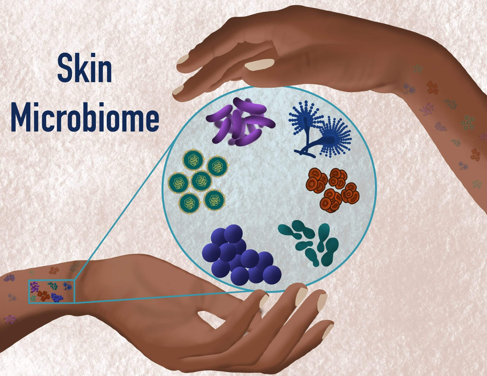
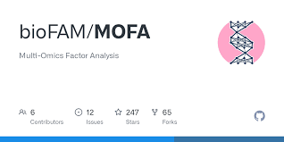
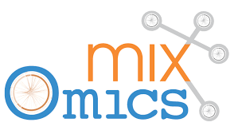

## Support #7993 {background-color="#E9F2D1"}

#### Association between microbiome, genetic susceptibility and psoriasis severity

:::{height="10%"}
{ width="20%" fig-align="center"}
:::

:::: {.columns}
::: {.fragment .column width="50%"}

 - 16S Data (skin and pharynx)
 - SNP Data (50 markers)
 - Metadata

:::

::: {.fragment .column width="50%"}

  - 146 samples 
    - 40 patients (38 with both skin and pharynx)
    - 68 controls (skin)
  - Type
    - Lesional and Non-Lesional
  - Severity
    - Continuous PASI values
  - Secondary confounders
    - BMI, Age, Sex, Alcohol & Smoking

:::
::::

## {background-color="#E9F2D1"}

::::: {.columns}
:::: { .column width="50%"}

### Challenges 

  - Data Integration
    - SNP data with Microbiome for PASI severity
  - Normalization of microbiome for DI
    - CLR and hope for the best?

::::

:::: {.fragment .column width="50%"}

### Plans

{ width="50%" }

{ width="50%" }

::::
:::::

## {background-color="#E9F2D1" .center}
[Thank you!]{.largest}

